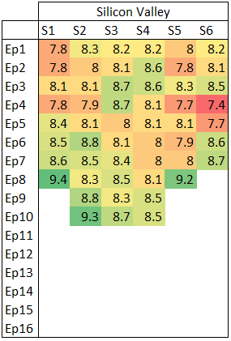

# Heat map
Python project to create heat maps using IMDB rating data.

# Example

## Specs:
  - Season along columns
  - Episodes along rows
  - Ratings in the table
  - Rating gradiant goes from 0 (red) to 10 (green)

# Data sources
  - https://www.imdb.com/interfaces/
  - https://datasets.imdbws.com/
Reminder: add documentation on datasets here.

# To do
  - Create parser to read imdb data sources
  - Create database of TV shows, seasons, episodes, and ratings
