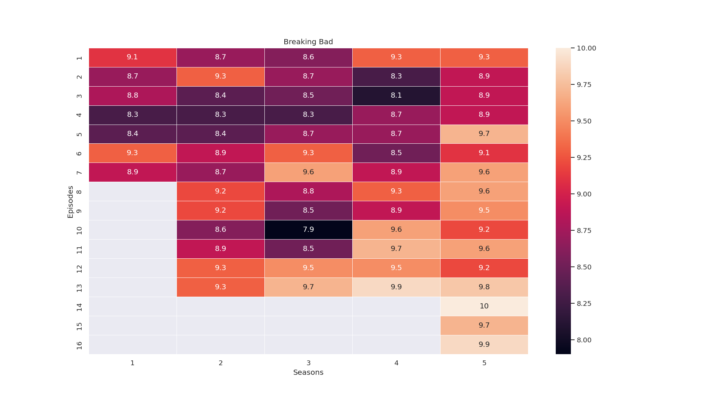

# IMDb Heatmaps
We use `pandas` and `seaborn` heatmap to visualize TV show ratings from IMDb.

## Example


# Data sources
IMDb provides a subset of their data for personal use here: https://datasets.imdbws.com/. We use two datasets for this project: 
  - title.episode.tsv.gz
  - title.ratings.tsv.gz

You can refer to https://www.imdb.com/interfaces/ for a description of the datasets.

# Setup 
To start, clone the repo and setup a virtual environment:

```bash
git clone https://github.com/phngyn/imdb.git
cd imdb

# Optional: setup virtual environment
pip install virtualenv
virtualenv .env
source .env/bin/activate # .\env\Scripts\activate for Windows
```

## Install the dependencies: 

```bash
# Install seaborn (includes pandas), requests, and beautifulsoup4
pip install -r requirements.txt
```
Pandas is a powerful open source data analysis and manipulation tool. We use it to work with the IMDb datasets and prepare our heatmap dataframe.

Seaborn is a Python data visualization library based on matplotlib. It provides a high-level interface for drawing attractive and informative statistical graphics. We use Seaborn's heatmap function to visualize our ratings dataframe.

Requests is a Python library to work with HTTP and BeautifulSoup is a Python library to work with HTML and XML files. We use these packages to read the IMDb page for the show name (parent show name is not included in any dataset).


## Download datasets:

Use `download.sh` to download the datasets:
```bash
bash download.sh
```

Alternatively, create a data folder and download the two datasets into the folder:
  - title.episode.tsv
  - title.ratings.tsv

In Windows, extracting the .gz file gives 'data.tsv'. Make sure to rename the datasets to match. 

# Usage
  1. In `heatmap.py` main function, set `show_id` to the show `parentTconst` you want to generate a heatmap.
  1. Run `heatmap.py`

You can look at `top250.txt` for a list of the top 250 rated TV shows. 


## To do
  - Support function to create heatmaps for multiple `show_ids` 